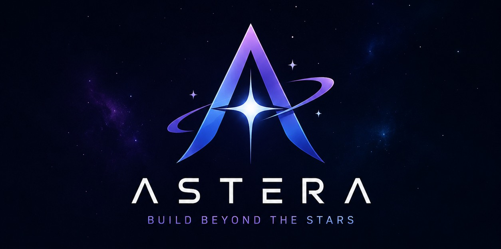
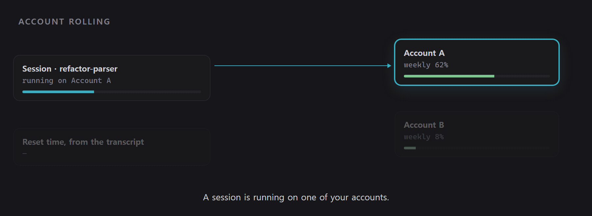
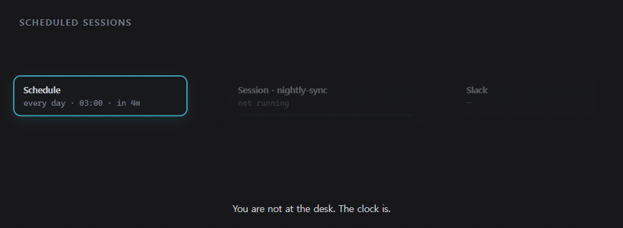

<div align="center">



**席を離れている間も、Claude Code と Codex を動かし続ける。**

[](https://github.com/parsingk/Astera/actions/workflows/ci.yml)
[](https://github.com/parsingk/Astera/releases/latest)
[](https://github.com/parsingk/Astera/releases)
[](LICENSE)


[ダウンロード](#インストール) · [できること](#できること) · [ドキュメント](#ドキュメント) · [バグ報告](https://github.com/parsingk/Astera/issues/new)

[English](README.md) · [한국어](README.ko.md) · **日本語** · [Español](README.es.md)

</div>

Astera は、あなたが席にいない間もエージェントのセッションを動かします。午前 3 時に開始するよう
スケジュールしておけば、その時刻に勝手に始まります。スケジュール実行かどうかにかかわらず、
セッションが利用量の上限に達すると、Astera はトランスクリプトからリセット時刻を読み取り、次の
アカウントに切り替えて*同じ*作業を再開します。ターンが終わったときと上限に達したときは Slack が
知らせます。セッションは 1 つのウィンドウに並び、それぞれが自分の git worktree に隔離されます。
さらに、あるエージェントが別のセッションを立ち上げてタスクを渡し、報告が来るまで待つこともできます。
同梱の CLI を使ってエージェント自身が行うので、一手ずつ指示する必要はありません。

> **状況:** Windows と macOS に対応。`claude` と `codex` の CLI を動かす仕組みなので、できることは
> インストール済みの CLI の能力次第です。

## インストール

**[Releases](https://github.com/parsingk/Astera/releases/latest)** から最新リリースを
ダウンロードして実行してください — Windows は `astera-<version>-setup.exe`、macOS は
`astera-<version>-universal.dmg` です。Windows ではその後アプリ自身が更新を行い、ダウンロードの
前に確認します。

> **macOS ビルドはまだ notarize されていません。** そのため 2 つの制約があります。まず Gatekeeper が
> 初回起動をブロックするので、アプリを Applications に移したあと、macOS が付けた隔離フラグを
> 外してください。
>
> ```bash
> xattr -cr /Applications/Astera.app
> ```
>
> これは「インターネットからダウンロードされた」という印を消すだけで、その印だけが障害です —
> アプリ自体は（ad-hoc で）署名済みなので、ほかは何も変わりません。クリック操作が好みなら
> システム設定 → **プライバシーとセキュリティ** → **このまま開く** でも構いません。Control クリック →
> **開く** は macOS 15 (Sequoia) で削除されたため使えません。
>
> また notarize されるまで自動更新は無効なので、新しいバージョンが出たら dmg を再度ダウンロードする
> ことになります。Windows では初回起動時に SmartScreen の警告が出ることがあります —
> **詳細情報 → 実行** を選んでください。
>
> SignPath Foundation のオープンソースプログラム（Windows）と Apple Developer ID（macOS）による
> 署名を準備中です — 誰が何に署名するのかは[コード署名ポリシー](docs/code-signing.md)、手順は
> [docs/releasing.md](docs/releasing.md) を参照してください。

ほかに必要なもの:

- **Windows 10 または 11**、あるいは **macOS 12 (Monterey) 以降**
- `PATH` 上の **[Claude Code](https://claude.com/claude-code) と Codex CLI のいずれか、または両方** —
  Astera はそれらを実行するだけで、置き換えるものではありません

## できること

**セッション**
- 複数の `claude` / `codex` セッションを 1 つのウィンドウで、タブと分割ペインとして
- プロジェクトごとのターミナル

**エディタとショートカット**
- キー 1 つでエクスプローラーを開閉します — `Ctrl`/`Cmd`+`Shift`+`E` がファイルツリーと Run
  ツールバー、Run コンソールを表示・非表示にし、ペインの配置はそのままです
- タブ列はペインごとに 1 つで、2 種類のタブを一緒に並べます。ファイルがそれを変更している
  セッションの隣に並び、分割すれば両方を同時に見られ、`Ctrl`+`Tab` がアクティブなペインの列を
  移動します
- テキストボックスではなく本物のエディタです。CodeMirror ベースで TypeScript・JavaScript・Python・
  Go・Rust・C/C++・Java・PHP・SQL・HTML・CSS・Markdown・JSON・YAML・XML のシンタックス
  ハイライトに対応し、タブで複数のファイルを開けます
- 項目ごとに git の状態（新規・変更・削除・コンフリクト）が表示されるファイルツリー、そして作成・
  名前変更・移動・コピー・削除・Finder / エクスプローラーで表示
- **ローカル履歴:** 削除の前にスナップショットを取るので、エージェントが片づけてしまったものも、
  自分で消したものも復元できます。30 日間、プロジェクトごとに最大 200 MB 保持
- すべてのショートカットは設定で割り当て直せます。既定は macOS が `Cmd`、それ以外が `Ctrl` —
  ペインの分割、ペイン間のフォーカス移動、セッションの切り替え、ファイルタブを閉じる
- ターミナルのフォント選択 — CJK テキストに使われるフォールバックも含めて

**アカウント**
- ベンダーごとに複数のアカウントを持ち、それぞれを専用の `CLAUDE_CONFIG_DIR` / `CODEX_HOME` で隔離
- **アカウントローリング:** セッションが利用量の上限に達すると、Astera がトランスクリプトから
  それを検知し、リセット時刻を割り出して、次のアカウントで作業を再開します
- 新しいアカウントの設定を既定のアカウントから取り込み（任意）— `settings.json`、MCP サーバーの
  一覧、そして `skills`・`commands`・`agents` ディレクトリ

<div align="center">

</div>

**スケジュール実行とリモート操作**
- 指定した時刻にセッションが始まるようスケジュール
- ターンの完了時と上限到達時の Slack 通知、そして Slack から返した返信をセッションへ送り返す —
  手元のスマートフォンから実行を見守れます

<div align="center">

</div>

**ベンダーをまたぐオーケストレーション**
- コーディネーターのセッションがワーカーのセッションにタスクを割り振ります — *別*ベンダーの
  ワーカーにも
- ワーカーは同梱の `astera` CLI で報告し、コーディネーターは完了・依存関係・質問・
  エスカレーションを待ちます
- 各タスクを専用の git worktree で実行できるので、並列のワーカーが衝突しません

**そのほか**
- 韓国語・英語・日本語・スペイン語の UI、および OS のロケールに従う System オプション
- GitHub Releases からの自動更新

## オーケストレーションのクイックスタート

設定でオーケストレーションを有効にしてからセッションを開始してください。そのセッションの `PATH` に
`astera` CLI が入り、使い方を説明するスキルも渡されるので、作業を調整してほしいと伝えるだけで
足ります。リファレンス全体を自分で読むには:

```bash
astera help
```

`astera` が `command not found` になる場合、絶対パスが `$ASTERA_CLI` に入っています — 同じ
プログラムです。`$ASTERA_CLI` が空なら、そのセッションは Astera が開始したものではないか、
オーケストレーションが無効になっています。

## ソースからビルドする

ビルドには **Node.js 22.12+** と、`node-pty` のネイティブ再ビルド
（`electron-builder install-app-deps` 経由）のための C++ ツールチェーンが必要です。Windows なら
**Visual Studio Build Tools (C++)**、macOS なら **Xcode Command Line Tools**
（`xcode-select --install`）です。

```bash
npm ci
npm run dev        # 開発モードで実行
npm run typecheck  # node と web の両プロジェクトに tsc を実行
npm run build      # バンドル
npm run dist       # 現在のプラットフォーム向けに dist-installer/ へパッケージ
npm run dist:win   # Windows インストーラ
npm run dist:mac   # macOS universal dmg + zip
```

`npm run dist` はアイコンを生成せず、コミット済みのアセット（Windows は `build/icon.ico`、macOS は
`build/icon.icns`、両方で共有する `resources/tray.png`）を読み込みます。ロゴを変えるときは
`resources/logo-source.png` を差し替え、対応するプラットフォームでスクリプトを実行し直して
ください — Windows は `powershell -File scripts/gen-icon.ps1`（ico/png）、macOS は
`sh scripts/gen-icon-mac.sh`（icns）— そのうえで生成されたアセットをコミットします。

テストは対象の隣に `*.test.ts` として置き、`npm test`（Vitest）で実行します。CI は型チェック、
テストスイート、そして完全なバンドルビルドを実行します。

## ドキュメント

- [Slack ボットのセットアップ](docs/slack-bot-setup.md) — アプリの作成、トークン、権限
- [リリース](docs/releasing.md) — バージョンを切って公開する手順
- [コード署名ポリシー](docs/code-signing.md) — 誰がリリースに署名するのか、何に署名するのか、
  プライバシー

## コントリビュート

Issue と Pull Request を歓迎します。始める前に知っておくとよいことをいくつか:

- PR を出す前に `npm run typecheck`、`npm test`、`npm run build` を実行してください — CI が
  確認するのはこれらです。
- 挙動を変える変更にはテストが伴うことを期待しています。ローリングのテストに触る前に知っておくべき
  ルールが 1 つあります。利用量上限の文言は意図的に `+` で分割してあります。Astera がセッションの
  出力からその文言を監視しているためです — [CONTRIBUTING](.github/CONTRIBUTING.md) を参照して
  ください。
- バグ報告は、アプリのバージョン、OS のバージョン、そしてアカウントローリングが関わる問題なら
  `rolling.log` の該当行があると、ずっと対応しやすくなります — Windows は
  `%APPDATA%\astera\rolling.log`、macOS は `~/Library/Application Support/astera/rolling.log`
  です。

## 謝辞

- ベンダーをまたぐオーケストレーションのモデル — コーディネーターがローカル CLI を通じてワーカー
  セッションにタスクを割り振り、質問でブロックし、所有権を確認する仕組み — は
  [Orca](https://github.com/stablyai/orca) のエージェントオーケストレーションを参考にしています。
  実装は本プロジェクト独自のものです。
- Windows のコード署名パイプラインは、Orca がリリースに用いている fail-open な SignPath の流れに
  従っています — [docs/releasing.md](docs/releasing.md) を参照してください。
- macOS リリースは Apple Developer ID で署名・notarize する想定で、ワークフローも準備済みです。
  Windows と違い、こちらは任意ではありません。署名がないと `electron-updater` の macOS 自動更新
  （Squirrel.Mac ベース）が更新のインストールを一切拒否するためです — そのため証明書が用意される
  までは ad-hoc 署名で配布され、自動更新は行われません。

## ライセンス

[Apache License 2.0](LICENSE).
