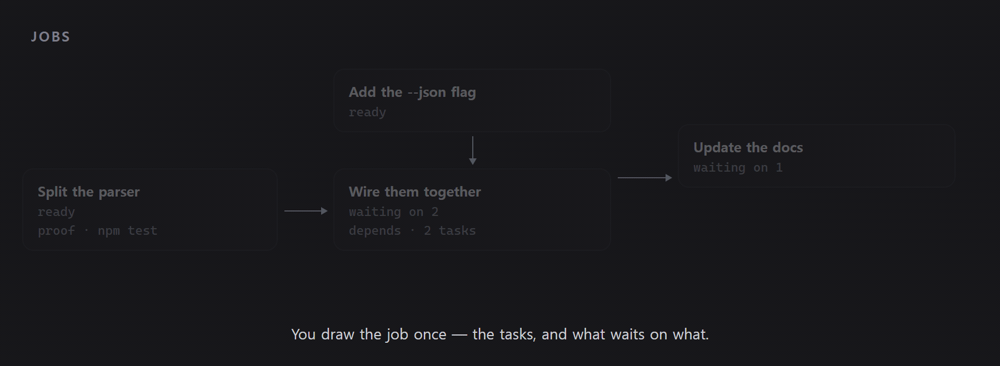

<div align="center">


**席を離れている間も、Claude Code と Codex を動かし続ける。**

[](https://github.com/parsingk/Astera/actions/workflows/ci.yml)
[](https://github.com/parsingk/Astera/releases/latest)
[](LICENSE)


[ダウンロード](#インストール) · [できること](#できること) · [Jobs](#jobs) · [ドキュメント](#ドキュメント) · [バグ報告](https://github.com/parsingk/Astera/issues/new)

[English](README.md) · [한국어](README.ko.md) · **日本語** · [Español](README.es.md)

</div>

Astera は、あなたが席にいない間もエージェントのセッションを動かします。午前 3 時に開始するよう
スケジュールしておけば、その時刻に勝手に始まります。スケジュール実行かどうかにかかわらず、
セッションが利用量の上限に達すると、Astera はトランスクリプトからリセット時刻を読み取り、次の
アカウントに切り替えて*同じ*作業を再開します。ターンが終わったときと上限に達したときは Slack が
知らせます。セッションは 1 つのウィンドウに並び、それぞれが自分の git worktree に隔離されます。
依存関係のある作業は Job として組み立て、Jobs サイドバーから実行するか、
`/astera-orchestration` スキルでコーディネーターに任せられます。

> **状況:** Windows・macOS・Linux に対応。`claude` と `codex` の CLI を動かす仕組みなので、できることは
> インストール済みの CLI の能力次第です。

## インストール

**[Releases](https://github.com/parsingk/Astera/releases/latest)** から最新リリースを
ダウンロードして実行してください — Windows は `astera-<version>-setup.exe`、macOS は
`astera-<version>-universal.dmg`、Linux は `astera-<version>-x86_64.AppImage` または
`astera-<version>-amd64.deb` です。Windows ではその後アプリ自身が更新を行い、ダウンロードの
前に確認します。

> **macOS ビルドはまだ notarize されていません。** そのため 2 つの制約があります。まず Gatekeeper が
> 初回起動をブロックするので、アプリを Applications に移したあと、macOS が付けた隔離フラグを
> 外してください。
>
> ```bash
> xattr -cr /Applications/Astera.app
> ```
>
> これは「インターネットからダウンロードされた」という印を消すだけで、その印だけが障害です —
> アプリ自体は（ad-hoc で）署名済みなので、ほかは何も変わりません。クリック操作が好みなら
> システム設定 → **プライバシーとセキュリティ** → **このまま開く** でも構いません。Control クリック →
> **開く** は macOS 15 (Sequoia) で削除されたため使えません。
>
> また notarize されるまで自動更新は無効なので、新しいバージョンが出たら dmg を再度ダウンロードする
> ことになります。Windows では初回起動時に SmartScreen の警告が出ることがあります —
> **詳細情報 → 実行** を選んでください。
>
> SignPath Foundation のオープンソースプログラム（Windows）と Apple Developer ID（macOS）による
> 署名を準備中です — 誰が何に署名するのかは[コード署名ポリシー](docs/code-signing.md)、手順は
> [docs/releasing.md](docs/releasing.md) を参照してください。Linux ビルドは署名しません。その配布
> 経路ではそれが通例です。

> **Linux では**、どちらのファイルもダウンロードしたままでは起動しません。AppImage には実行権限を
> 与えてください。
>
> ```bash
> chmod +x astera-<version>-x86_64.AppImage
> ```
>
> deb は `dpkg -i` ではなく apt で入れます。依存関係が一緒に解決されます。
>
> ```bash
> sudo apt install ./astera-<version>-amd64.deb
> ```
>
> 対応下限は deb 自身が宣言しているので、それより古いシステムには apt が導入を拒否します — 入る
> けれど起動しない、という状態にはなりません。

ほかに必要なもの:

- **Windows 10 または 11**、**macOS 12 (Monterey) 以降**、あるいは **Ubuntu 22.04 / Debian 12 以降**
- `PATH` 上の **[Claude Code](https://claude.com/claude-code) と Codex CLI のいずれか、または両方** —
  Astera はそれらを実行するだけで、置き換えるものではありません

## できること

**セッション**
- 複数の `claude` / `codex` セッションを 1 つのウィンドウで、タブと分割ペインとして
- プロジェクトごとのターミナル

**エディタとショートカット**
- キー 1 つでエクスプローラーを開閉します — `Ctrl`/`Cmd`+`Shift`+`E` がファイルツリーと Run
  ツールバー、Run コンソールを表示・非表示にし、ペインの配置はそのままです
- タブ列はペインごとに 1 つで、2 種類のタブを一緒に並べます。ファイルがそれを変更している
  セッションの隣に並び、分割すれば両方を同時に見られ、`Ctrl`+`Tab` がアクティブなペインの列を
  移動します
- テキストボックスではなく本物のエディタです。CodeMirror ベースで TypeScript・JavaScript・Python・
  Go・Rust・C/C++・Java・PHP・SQL・HTML・CSS・Markdown・JSON・YAML・XML のシンタックス
  ハイライトに対応し、タブで複数のファイルを開けます
- **Markdown は並べて読めます:** Markdown ファイルはエディタ・分割・プレビューのいずれかで開き、
  `Ctrl`/`Cmd`+`Shift`+`V` が 3 つを切り替えます。分割では両側のスクロールが互いに追随します
- 項目ごとに git の状態（新規・変更・削除・コンフリクト）が表示されるファイルツリー、そして作成・
  名前変更・移動・コピー・削除・Finder / エクスプローラーで表示
- **ローカル履歴:** 削除の前にスナップショットを取るので、エージェントが片づけてしまったものも、
  自分で消したものも復元できます。30 日間、プロジェクトごとに最大 200 MB 保持
- すべてのショートカットは設定で割り当て直せます。既定は macOS が `Cmd`、それ以外が `Ctrl` —
  ペインの分割、ペイン間のフォーカス移動、セッションの切り替え、ファイルタブを閉じる

**実行構成**
- 実行構成には種類があります — Shell・npm・Node.js・Gradle・Maven・cargo・go・Python・pytest・
  Docker Compose・Dockerfile・.NET — そして、その種類が実際に持つ項目だけを保持します
- コマンドは実行するときに組み立てられます。Gradle のラッパー、ロックファイルが示すパッケージ
  マネージャー、シェルに合わせたクォートは、欄に書き込むものではなく、そのときに決まります
- プロジェクトのビルドファイルを読むので、npm スクリプトはそのまま構成として並び、Gradle・Maven の
  プロジェクトには標準のタスクとゴールが用意されます。自動で見つかったものは斜体で表示され、
  手を入れた時点で自分の構成として保存されます

**アカウント**
- ベンダーごとに複数のアカウントを持ち、それぞれを専用の `CLAUDE_CONFIG_DIR` / `CODEX_HOME` で隔離
- **アカウントローリング:** セッションが利用量の上限に達すると、Astera がトランスクリプトから
  それを検知し、リセット時刻を割り出して、次のアカウントで作業を再開します
- **再開方法:** 既定では CLI の元の会話を再開し、必要なら短いチェックポイントから次のセッションを
  始める **スマート再開 (実験)** を選べます
- 新しいアカウントの設定を既定のアカウントから取り込み（任意）— `settings.json`、MCP サーバーの
  一覧、そして `skills`・`commands`・`agents` ディレクトリ

<div align="center">

<video src="https://github.com/parsingk/Astera/raw/main/assets/astera-demo-rolling.mp4" width="820" controls muted>
<a href="assets/astera-demo-rolling.mp4">画面録画: セッションが上限に達すると Astera が次のアカウントに切り替えて同じ会話を続け、行き先がなければ再開時刻を表示する</a>
</video>
</div>

**スケジュール実行とリモート操作**
- 指定した時刻にセッションが始まるようスケジュール
- ターンの完了時と上限到達時の Slack 通知、そして Slack から返した返信をセッションへ送り返す —
  手元のスマートフォンから実行を見守れます

<div align="center">

<video src="https://github.com/parsingk/Astera/raw/main/assets/astera-demo-schedule.mp4" width="820" controls muted>
<a href="assets/astera-demo-schedule.mp4">画面録画: スケジュールを設定したセッションが、その時刻になると自ら作業を始める</a>
</video>
</div>

**外観**
- テーマ 7 種 — Vega、Orion、Umbra、Aurora、Antares、Quasar、Sirius。カードがそれぞれ自分のパレットで自身を
  描くので、名前ではなく見た目で選べます
- テーマは色だけではありません: 角の丸み、影、UI の書体、行の密度も一緒に変わります — Quasar は
  Umbra より 1 画面に多く収まります
- 切り替えると、すでに開いているものも変わります — 動いているターミナルは色だけを差し替えるので、
  スクロールバックはそのまま残ります
- ターミナルのフォントは別に選びます — CJK テキストに使われるフォールバックも含めて

**そのほか**
- 韓国語・英語・日本語・スペイン語の UI、および OS のロケールに従う System オプション
- GitHub Releases からの自動更新

## Jobs

Jobs はオプトインです。設定で**エージェントオーケストレーション**を有効にすると、Jobs
サイドバーが表示されます。ジョブは Claude と Codex で実行できるタスクの依存関係グラフで、
動かし方は 2 つあります。

### 1. Jobs サイドバーで組み立てる

1. プロジェクトが git リポジトリで、ブランチがチェックアウトされていることを確認します。
2. **新しい作業** を押し、**目標**・**コーディネーターアカウント**・**同時実行**を設定し、
   必要ならスケジュールを追加します。
3. Task ごとに指示、1 つ以上のワーカーアカウント、先行 Task を設定します。必要ならビルド・
   テスト・別ベンダーのレビューを完了条件にできます。
4. **実行**を押します。通常の Job はコーディネーターを開き、予約 Job はスケジュールを有効にします。

Jobs 画面では依存関係グラフ、実行中のワーカー、質問、タイムラインを確認できます。並列 Task は
別々の git worktree で実行でき、結果は詳細画面で **マージ** を押すまで現在のブランチには入りません。
詳しくは [Job のライフサイクル](docs/jobs.md) を参照してください（現在は韓国語のみ）。

### 2. `astera-orchestration` スキルで実行 — エージェントが調整

コーディネーターのセッションを始める**前にエージェントオーケストレーションを有効にしてください**。
起動時に、そのセッションの `PATH` へ `astera` CLI が追加され、`astera-orchestration` スキルも
渡されます。たとえば次のように頼めます。

> `astera-orchestration` スキルを使って、認証モジュールをリファクタリングし、その後に回帰テストを
> 追加し、テストスイートで検証する作業を調整して。

スキルは `/astera-orchestration` として明示的にも呼び出せます。監督、完了の追跡、依存関係の調整が
必要な複数段階の作業向けです。コーディネーターが Run と Task を作成し、Claude と Codex の
ワーカーへ割り振り、完了報告を待って必要な質問をユーザーへ返します。開いているプロジェクトの
Run は Jobs サイドバーにも表示されます。

スキルはセッション開始時に読み込まれるため、先にエージェントオーケストレーションを有効にしてから
新しいコーディネーターセッションを開いてください。単純な一度きりの引き渡しには必要ありません。

<div align="center">

<video src="https://github.com/parsingk/Astera/raw/main/assets/astera-killer-demo.mp4" width="820" controls muted>
<a href="assets/astera-killer-demo.mp4">画面録画: ジョブが依存グラフに沿って進む — 準備できたタスクが動き出し、上限に達したワーカーが自ら再開し、最後のタスクは両方の依存を待つ</a>
</video>
</div>

コーディネーター CLI のリファレンスを見るには:

```bash
astera help
```

`astera` が `PATH` にない場合は `$ASTERA_CLI` のパスを使います。値が空なら、そのセッションは
Astera が開始したものではないか、エージェントオーケストレーションが無効になっています。

## ソースからビルドする

ビルドには **Node.js 22.12+** と、`node-pty` のネイティブ再ビルド
（`electron-builder install-app-deps` 経由）のための C++ ツールチェーンが必要です。Windows なら
**Visual Studio Build Tools (C++)**、macOS なら **Xcode Command Line Tools**
（`xcode-select --install`）、Linux なら **build-essential** と **python3** です — Linux には
node-pty のプリビルドがなく、常にコンパイルされます。

```bash
npm ci
npm run dev        # 開発モードで実行
npm run typecheck  # node と web の両プロジェクトに tsc を実行
npm run build      # バンドル
npm run dist       # 現在のプラットフォーム向けに dist-installer/ へパッケージ
npm run dist:win   # Windows インストーラ
npm run dist:mac   # macOS universal dmg + zip
npm run dist:linux # Linux AppImage + deb
```

`npm run dist` はアイコンを生成せず、コミット済みのアセット（Windows は `build/icon.ico`、macOS は
`build/icon.icns`、両方で共有する `resources/tray.png`）を読み込みます。ロゴを変えるときは
`resources/logo-source.png` を差し替え、対応するプラットフォームでスクリプトを実行し直して
ください — Windows は `powershell -File scripts/gen-icon.ps1`（ico/png）、macOS は
`sh scripts/gen-icon-mac.sh`（icns）— そのうえで生成されたアセットをコミットします。

テストは対象の隣に `*.test.ts` として置き、`npm test`（Vitest）で実行します。CI は型チェック、
テストスイート、そして完全なバンドルビルドを実行します。

## ドキュメント

- [Slack ボットのセットアップ](docs/slack-bot-setup.md) — アプリの作成、トークン、権限
- [リリース](docs/releasing.md) — バージョンを切って公開する手順
- [コード署名ポリシー](docs/code-signing.md) — 誰がリリースに署名するのか、何に署名するのか、
  プライバシー

## コントリビュート

Issue と Pull Request を歓迎します。始める前に知っておくとよいことをいくつか:

- PR を出す前に `npm run typecheck`、`npm test`、`npm run build` を実行してください — CI が
  確認するのはこれらです。
- 挙動を変える変更にはテストが伴うことを期待しています。ローリングのテストに触る前に知っておくべき
  ルールが 1 つあります。利用量上限の文言は意図的に `+` で分割してあります。Astera がセッションの
  出力からその文言を監視しているためです — [CONTRIBUTING](.github/CONTRIBUTING.md) を参照して
  ください。
- バグ報告は、アプリのバージョン、OS のバージョン、そしてアカウントローリングが関わる問題なら
  `rolling.log` の該当行があると、ずっと対応しやすくなります — Windows は
  `%APPDATA%\astera\rolling.log`、macOS は `~/Library/Application Support/astera/rolling.log`
  です。

## 謝辞

- ベンダーをまたぐオーケストレーションのモデル — コーディネーターがローカル CLI を通じてワーカー
  セッションにタスクを割り振り、質問でブロックし、所有権を確認する仕組み — は
  [Orca](https://github.com/stablyai/orca) のエージェントオーケストレーションを参考にしています。
  実装は本プロジェクト独自のものです。
- Windows のコード署名パイプラインは、Orca がリリースに用いている fail-open な SignPath の流れに
  従っています — [docs/releasing.md](docs/releasing.md) を参照してください。
- macOS リリースは Apple Developer ID で署名・notarize する想定で、ワークフローも準備済みです。
  Windows と違い、こちらは任意ではありません。署名がないと `electron-updater` の macOS 自動更新
  （Squirrel.Mac ベース）が更新のインストールを一切拒否するためです — そのため証明書が用意される
  までは ad-hoc 署名で配布され、自動更新は行われません。

## ライセンス

[Apache License 2.0](LICENSE).
