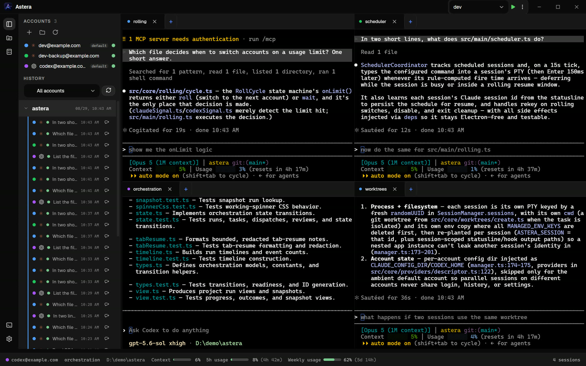
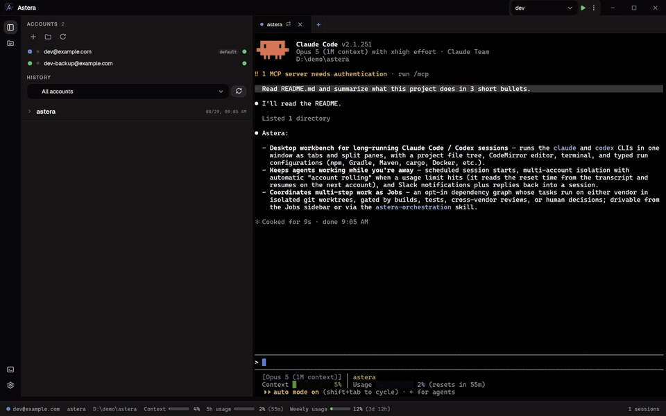
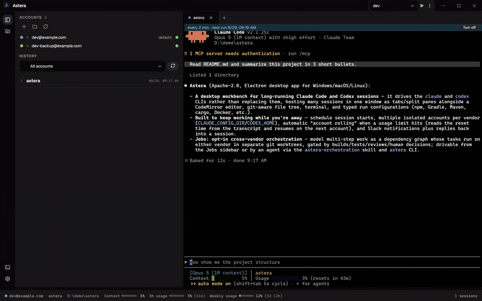
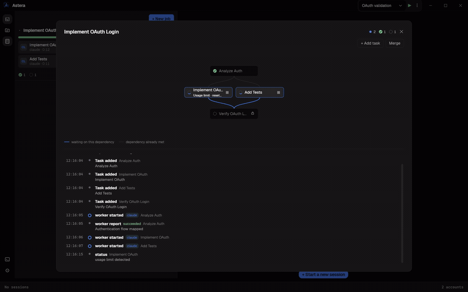

<div align="center">


**자리에 없는 동안에도 Claude Code와 Codex를 계속 일하게 하세요.**

[](https://github.com/parsingk/Astera/actions/workflows/ci.yml)
[](https://github.com/parsingk/Astera/releases/latest)
[](LICENSE)


[다운로드](#설치) · [기능](#무엇을-하는-앱인가) · [Jobs](#jobs) · [문서](#문서) · [버그 신고](https://github.com/parsingk/Astera/issues/new)

[English](README.md) · **한국어** · [日本語](README.ja.md) · [Español](README.es.md)



</div>


## 무엇을 하는 앱인가

**프로젝트 작업 공간**
- 다중 `claude` / `codex` 세션을 여러 화면으로 분할하여 작업
- 프로젝트별 터미널

**계정**
- 벤더별로 여러 계정을 둘 수 있으며, 각 계정은 자체 `CLAUDE_CONFIG_DIR` / `CODEX_HOME`으로 격리
- **계정 롤링:** 세션이 사용량 한도에 걸리면 Astera가 트랜스크립트에서 이를 감지하고 리셋 시각을
  계산한 뒤, 다음 계정에서 작업을 이어갑니다
- 새 계정의 설정을 기본 계정에서 가져오기(선택) — `settings.json`, MCP 서버 목록, 그리고 `skills`·
  `commands`·`agents` 디렉터리

<div align="center">


<p><a href="https://github.com/parsingk/Astera/blob/main/assets/astera-demo-rolling.mp4">▶ 전체 영상 (28초)</a></p>
</div>

**스마트 재개 (실험)**
- 기본값은 꺼져 있습니다. **설정 → 일반 → 세션 재개 방식** 에서 CLI 의 기존 Resume 과 이 방식 중
  하나를 고릅니다
- 켜 두면, 한도에 걸려 다음 계정으로 넘어갈 때 그 세션을 **백지로** 띄우고 대화 전체를 재생하는
  대신 간결한 체크포인트를 첫 메시지로 건넵니다
- 체크포인트에는 작업 폴더와 git 상태, 최근 요청들(시간 순), 그 대화가 손댄 파일, 마지막으로 실행한
  명령, 그리고 대화의 꼬리가 담기고, 들어가는 길에 비밀값은 가려집니다
- 체크포인트를 만들지 못하면 원래의 재개 경로로 내려갑니다 — 이 설정을 켠다고 해서 롤이 전보다
  나빠지는 경우는 없습니다

**예약 실행과 Slack 원격 제어**
- 지정한 시각에 세션이 시작되도록 예약
- 턴이 끝나거나 한도에 걸릴 때 Slack 알림, 그리고 Slack에서 보낸 답장을 세션으로 다시 전달 —
  휴대폰으로 진행 상황을 지켜볼 수 있습니다

<div align="center">


<p><a href="https://github.com/parsingk/Astera/blob/main/assets/astera-demo-schedule.mp4">▶ 전체 영상 (22초)</a></p>
</div>

**실행 구성**
- 실행 구성은 Shell·npm·Node.js·Gradle·Maven·cargo·go·Python·pytest·Docker Compose·Dockerfile·
  .NET 유형을 지원하며, 유형별로 필요한 항목만 입력합니다
- 명령은 실행할 때 조합됩니다. Gradle Wrapper, 락파일이 가리키는 패키지 매니저, 셸에 맞는 인용은
  입력란에 직접 적는 대신 실행 시점에 결정됩니다
- 프로젝트의 빌드 파일을 읽어 npm 스크립트를 실행 구성으로 가져오고, Gradle·Maven 프로젝트에는 표준
  태스크와 골을 준비합니다. 자동으로 찾은 구성은 기울임꼴로 표시되며, 수정하는 순간 내 구성으로
  저장됩니다

**GitHub**
- worktree 목록에서 PR 상태가 표시됩니다
- 기준 브랜치에 없는 커밋을 가진 worktree는 PR 만들기를 제안합니다. 대화상자 하나가 브랜치를 푸시하고,
  그 worktree를 갈라 나온 브랜치를 기준으로 PR을 엽니다
- 이미 쓰고 있는 `gh` 로그인을 빌려 씁니다. 토큰은 저장하지 않습니다

**How It Works (실험)**
- How It Works는 코드를 읽지 않는 사람을 위한 기능입니다. `/astera-task` 스킬로 하려는 일을
  적으면 그때부터 기록 준비가 시작되고, 작업이 완료되면 분석 후 작업에 대한 내용을 기록합니다
- `/astera-task`는 오케스트레이션 쪽과 마찬가지로 앱이 계정에 심어 주는 스킬입니다. 에이전트에게
  시작을 알리고, 사용자의 메시지가 몇 번 오가든 계속 그 일을 하고, 목표를 다하면 끝을 알리라고
  일러 둡니다 — 목표만 적으시면 나머지는 에이전트가 합니다
- Claude Code 와 Codex 의 네이티브 `/goal` 도 같은 방식으로 기록됩니다. 단, Claude는 작업이
  완료되면 기록이 자동으로 완료 처리 되지만, Codex는 사용자가 직접 완료 처리 해야 합니다
- 세션당 기록될 수 있는 작업은 하나입니다. 이미 기록 중인 작업이 있을 때 들어온 요청은 이전 기록 작업을 먼저 완료해 달라고
  알리고, 완료되면 다음 기록 작업이 시작됩니다
- Jobs 의 Run(`/astera-orchestration`)도 동일하게 분석 & 기록됩니다. 단, Run이 마무리되고 나서
  분석이 시작됩니다
- 파일이 하나도 바뀌지 않은 작업은 줄을 남기지 않습니다. 선언만 하고 이야기만 나눴다면 쓸
  내용이 없습니다
- 기본값은 꺼짐입니다. 설정에서 **작업 단위 추적**을 켜고, 기록을 쓸 **설명 생성 계정**을
  고릅니다. 이미 열려 있는 세션에는 적용되지 않습니다 — 새 세션부터 동작합니다
- 설정에서 이 기능을 켜고 난 뒤의 작업만 기록합니다

**에디터와 단축키**
- 키 하나로 탐색기를 켜고 끕니다 — `Ctrl`/`Cmd`+`Shift`+`E`가 파일 트리와 Run 툴바, Run 콘솔을
  여닫고 페인 배치는 그대로 둡니다
- 나머지 두 사이드바 화면에도 키가 하나씩 있습니다 — Jobs는 `Ctrl`/`Cmd`+`Shift`+`J`,
  How It Works는 `Ctrl`/`Cmd`+`Shift`+`H`
- 각 페인에는 파일 탭과 세션 탭을 함께 담는 탭 표시줄이 하나씩 있습니다. 파일을 수정하는 세션은
  그 파일 옆에 둘 수 있고, 분할 화면에서는 둘을 나란히 보며, `Ctrl`+`Tab`으로 활성 페인의 탭을
  순환합니다
- 단순 텍스트 상자가 아닌 CodeMirror 기반 편집기입니다. TypeScript·JavaScript·Python·Go·Rust·
  C/C++·Java·PHP·SQL·HTML·CSS·Markdown·JSON·YAML·XML 문법 강조를 지원하며, 여러 파일을 탭으로
  열 수 있습니다
- **마크다운은 나란히 볼 수 있습니다:** 마크다운 파일은 에디터·분할·프리뷰 중 하나로 열리고
  `Ctrl`/`Cmd`+`Shift`+`V`가 셋을 순환합니다. 분할에서는 양쪽 스크롤이 서로를 따라갑니다
- 항목마다 git 상태(추가·수정·삭제·충돌)를 표시하는 파일 트리와 생성·이름 변경·이동·복사·삭제·
  Finder/Explorer에서 보기
- **로컬 히스토리:** 삭제하기 전에 스냅샷을 남기므로, 에이전트가 정리해 버린 것도 직접 지운 것도
  되살릴 수 있습니다. 30일간, 프로젝트당 최대 200 MB 보관
- 모든 단축키는 설정에서 다시 지정할 수 있고, 기본값은 macOS에서 `Cmd`, 그 외에서 `Ctrl`입니다 —
  창 분할, 분할된 창 사이 포커스 이동, 세션 순회, 파일 탭 닫기, 사이드바 화면 열기

**테마와 모양**
- 테마 일곱 — Vega, Orion, Umbra, Aurora, Antares, Quasar, Sirius. 카드마다 자기 팔레트로 스스로를 그리므로
  이름이 아니라 눈으로 고릅니다
- 테마는 색만이 아닙니다: 모서리 반경, 그림자, UI 서체, 행 밀도가 함께 따라옵니다 — Quasar는 Umbra보다
  한 화면에 더 많이 담습니다
- 바꾸면 이미 열려 있는 것도 함께 바뀝니다 — 돌고 있는 터미널은 색만 갈아 끼우므로 스크롤백이
  그대로 남습니다
- 터미널 폰트는 따로 고릅니다 — CJK 텍스트에 쓰이는 대체 폰트까지

**그 외**
- 한국어·영어·일본어·스페인어 UI, 그리고 OS 로케일을 따르는 System 옵션
- GitHub Releases를 통한 자동 업데이트

## Jobs

Jobs는 선택 기능입니다. 설정에서 **에이전트 오케스트레이션**을 켜면 Jobs 사이드바가 나타납니다.
Job은 Claude와 Codex에서 실행할 수 있는 Task의 의존성 그래프이며, 실행 방식은 두 가지입니다.

<div align="center">


<p><a href="https://github.com/parsingk/Astera/blob/main/assets/astera-killer-demo.mp4">▶ 전체 영상 (30초)</a></p>
</div>

### 1. Jobs 사이드바에서 구성

1. 프로젝트가 git 저장소이고 브랜치가 체크아웃되어 있는지 확인합니다.
2. **새 작업**을 눌러 **목표**와 **코디네이터 계정**, **동시 실행**을 정하고 필요하면 예약을
   추가합니다.
3. Task마다 지시와 하나 이상의 워커 계정, 선행 Task를 정합니다. 필요하면 빌드·테스트·다른 벤더의
   검토를 완료 조건으로 연결할 수 있습니다.
4. **실행**을 누릅니다. 일반 Job은 코디네이터를 열고, 예약 Job은 예약을 활성화합니다.

Jobs 화면에서는 의존성 그래프, 실행 중인 워커, 질문과 타임라인을 볼 수 있습니다. 병렬 Task는 각자
git worktree에서 실행할 수 있고, 완료 결과는 상세 화면에서 **병합**을 누르기 전까지 프로젝트의 현재
브랜치에 들어오지 않습니다. 자세한 흐름은 [Job은 어떻게 도는가](docs/jobs.md)를 보세요.

### 2. `astera-orchestration` 스킬로 실행 — 에이전트가 조율

코디네이터 세션을 시작하기 **전에 에이전트 오케스트레이션을 켜세요**. 그러면 새 세션의 `PATH`에
`astera` CLI가 올라가고 `astera-orchestration` 스킬이 함께 주어집니다. 다음처럼 자연어로 요청할 수
있습니다.

> `astera-orchestration` 스킬을 사용해 인증 모듈을 리팩터링하고, 그 뒤 회귀 테스트를 추가한 다음,
> 테스트 스위트로 검증하는 작업을 조율해 줘.

스킬은 `/astera-orchestration`으로 직접 호출할 수도 있습니다. 감독·완료 추적·의존성 조율이 필요한
여러 단계의 작업에 사용합니다. 코디네이터가 Run과 Task를 만들고 Claude·Codex 워커에게 배분한 뒤,
완료 보고를 기다리고 필요한 질문을 사용자에게 전달합니다. 현재 연 프로젝트의 Run은 Jobs
사이드바에도 표시되고, **작업 단위 추적**을 켜 두었다면 끝날 때 How It Works 에 한 줄씩 남습니다 —
직접 시작한 Run과 똑같습니다.

스킬은 세션 시작 시 로드되므로 에이전트 오케스트레이션을 먼저 켠 뒤 새 코디네이터 세션을 여세요.
한 번 넘기고 끝나는 단순 작업에는 오케스트레이션 Run이 필요하지 않습니다.

코디네이터 CLI 레퍼런스를 보려면:

```bash
astera help
```

`astera`가 `PATH`에 없다면 `$ASTERA_CLI`의 경로를 사용하세요. 값이 비어 있다면 그 세션은 Astera가
시작한 것이 아니거나 에이전트 오케스트레이션이 꺼져 있습니다.

## 설치

**[Releases](https://github.com/parsingk/Astera/releases/latest)** 에서 최신 릴리스를 내려받아
실행합니다. Windows는 `astera-<version>-setup.exe`, macOS는 `astera-<version>-universal.dmg`,
Linux는 `astera-<version>-x86_64.AppImage` 또는 `astera-<version>-amd64.deb`를 사용합니다.
Windows에서는 이후 업데이트를 자동으로 확인하고, 내려받기 전에 묻습니다.

> **macOS 빌드는 아직 공증(notarize)되지 않았습니다.** 따라서 Gatekeeper가 첫 실행을 막을 수 있습니다.
> 앱을 Applications로 옮긴 뒤 macOS가 붙인 격리 플래그를 지워 주세요.
>
> ```bash
> xattr -cr /Applications/Astera.app
> ```
>
> 이 명령은 "인터넷에서 다운로드됨" 표시만 제거합니다. 그 표시가 유일한 실행 차단 요인이며, 앱은
> ad-hoc 서명 상태로 유지됩니다. 클릭으로 처리하고 싶다면 시스템 설정 → **개인정보 보호 및 보안** →
> **확인 없이 열기**를 사용해도 됩니다. Control-클릭 → **열기** 방식은 macOS 15 (Sequoia)에서
> 없어져 더 이상 동작하지 않습니다.
>
> 그리고 공증 전까지는 자동 업데이트가 꺼져 있어, 새 버전이 나오면 dmg를 다시 받아야 합니다.
> Windows에서는 첫 실행 때 SmartScreen 경고가 뜰 수 있습니다 — **추가 정보 → 실행** 을 누르세요.
>
> SignPath Foundation 오픈소스 프로그램(Windows)과 Apple Developer ID(macOS)를 통한 서명을
> 준비하고 있습니다 — 누가 무엇에 서명하는지는 [코드 서명 정책](docs/code-signing.md), 구체적인
> 절차는 [docs/releasing.md](docs/releasing.md)를 보세요. Linux 빌드는 서명하지 않습니다. Linux
> 배포 환경에서는 일반적인 방식입니다.

> **Linux에서는** 두 파일 모두 다운로드만으로는 사용할 수 없습니다. AppImage에는 실행 권한을 주세요.
>
> ```bash
> chmod +x astera-<version>-x86_64.AppImage
> ```
>
> deb는 `dpkg -i` 대신 apt로 설치해야 의존성도 함께 설치됩니다.
>
> ```bash
> sudo apt install ./astera-<version>-amd64.deb
> ```
>
> 지원 하한은 deb에 선언돼 있어서, 더 낮은 시스템에는 apt가 설치를 거부합니다 — 설치는 되고 실행만
> 안 되는 상황을 만들지 않습니다.

이 밖에 필요한 것:

- **Windows 10 또는 11**, **macOS 12 (Monterey) 이상**, 혹은 **Ubuntu 22.04 / Debian 12 이상**
- `PATH` 상의 **[Claude Code](https://claude.com/claude-code) 또는 Codex CLI** (둘 다여도 됩니다) —
  Astera는 이들을 실행할 뿐, 대체하지는 않습니다

## 소스에서 빌드하기

빌드에는 **Node.js 22.12+**와 `node-pty` 네이티브 재빌드(`electron-builder install-app-deps`)를 위한
C++ 툴체인이 필요합니다. Windows는 **Visual Studio Build Tools (C++)**, macOS는
**Xcode Command Line Tools** (`xcode-select --install`), Linux는 **build-essential**과 **python3**
입니다 — Linux에는 node-pty 프리빌드가 없어 항상 직접 컴파일합니다.

```bash
npm ci
npm run dev        # 개발 모드로 실행
npm run typecheck  # node·web 두 프로젝트에 tsc 실행
npm run build      # 번들
npm run dist       # 현재 플랫폼용으로 dist-installer/ 에 패키징
npm run dist:win   # Windows 인스톨러
npm run dist:mac   # macOS universal dmg + zip
npm run dist:linux # Linux AppImage + deb
```

`npm run dist`는 아이콘을 생성하지 않고 커밋된 에셋(Windows `build/icon.ico`, macOS `build/icon.icns`,
양쪽 공용 `resources/tray.png`)을 읽습니다. 로고를 바꿀 때는 `resources/logo-source.png`를 교체하고
해당 플랫폼에서 스크립트를 다시 실행하세요 — Windows는 `powershell -File scripts/gen-icon.ps1`
(ico/png), macOS는 `sh scripts/gen-icon-mac.sh` (icns) — 그리고 생성된 에셋을 커밋하세요.

테스트는 대상 옆에 `*.test.ts`로 두고 `npm test`(Vitest)로 실행합니다. CI는 타입체크, 테스트, 전체
번들 빌드를 돌립니다.

## 문서

- [Slack 봇 설정](docs/slack-bot-setup.md) — 앱 생성, 토큰, 권한
- [릴리스](docs/releasing.md) — 버전을 자르고 배포하는 방법
- [코드 서명 정책](docs/code-signing.md) — 누가 릴리스에 서명하는지, 무엇에 서명하는지, 개인정보

## 기여

이슈와 풀 리퀘스트를 환영합니다. 시작하기 전에 알아 두면 좋은 것들:

- PR을 열기 전에 `npm run typecheck`, `npm test`, `npm run build`를 실행하세요 — CI가 확인하는 것들입니다.
- 동작을 바꾸는 변경에는 테스트도 함께 포함해야 합니다. 롤링 테스트를 수정할 때 알아 둘 규칙이
  하나 있습니다. 사용량 한도 문구는 Astera가 세션 출력에서 감시하므로 의도적으로 `+`로 나눠 두었습니다
  — [CONTRIBUTING](.github/CONTRIBUTING.md)을 보세요.
- 버그 신고에는 앱 버전, OS 버전, 그리고 계정 롤링과 관련된 문제라면 `rolling.log`의 해당 부분을
  함께 적어 주시면 훨씬 다루기 쉽습니다 — Windows는 `%APPDATA%\astera\rolling.log`, macOS는
  `~/Library/Application Support/astera/rolling.log` 입니다.

## 감사

- 벤더를 넘나드는 오케스트레이션 모델 — 코디네이터가 로컬 CLI를 통해 워커 세션에 작업을 배분하고,
  질문으로 블로킹하고, 소유권을 확인하는 방식 — 은
  [Orca](https://github.com/stablyai/orca)의 에이전트 오케스트레이션에서 착안했습니다. 구현은
  이 프로젝트의 것입니다.
- Windows 코드 서명 파이프라인은 Orca가 릴리스에 쓰는 fail-open SignPath 흐름을 따릅니다 —
  [docs/releasing.md](docs/releasing.md)를 보세요.
- macOS 릴리스는 Apple Developer ID로 서명·공증하도록 되어 있고 워크플로도 준비되어 있습니다.
  Windows와 달리 이쪽은 선택이 아닙니다. 서명이 없으면 `electron-updater`의 macOS 자동
  업데이트(Squirrel.Mac 기반)가 업데이트 설치를 아예 거부하기 때문입니다 — 그래서 인증서가
  준비될 때까지는 ad-hoc 서명으로 배포되며 자동 업데이트가 되지 않습니다.

## 라이선스

[Apache License 2.0](LICENSE).
