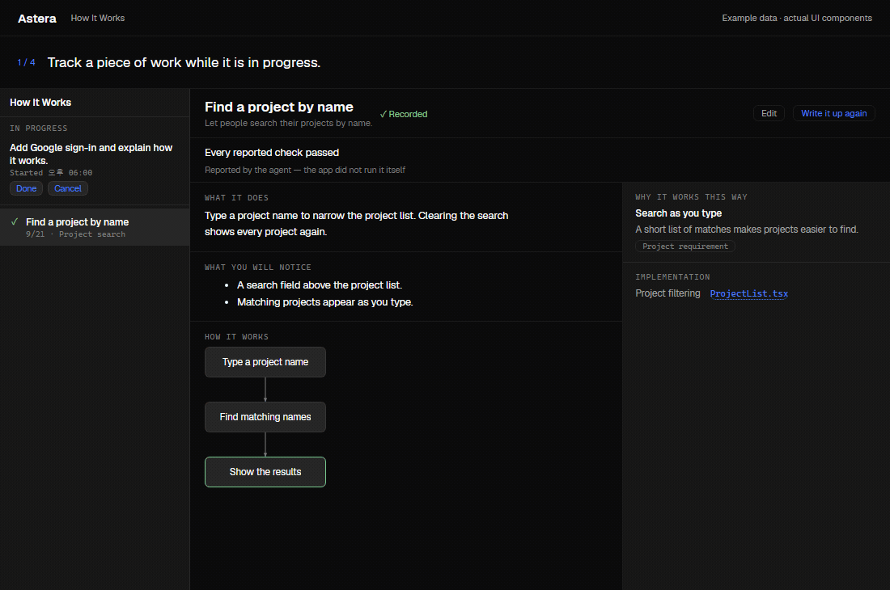

# How It Works

How It Works turns a finished piece of work into an explanation you can read without following
every code change. Each record keeps your original request and explains what changed, how it
works, why it was built that way, and which files are involved.

It is experimental and off by default. It records work declared after you enable tracking;
it does not scan your old conversations to create a history.



The GIF uses the actual How It Works components with fictional project data in the Umbra theme.
The numbered explanatory header is part of the walkthrough.

## Record your first task

1. Open **Settings → How It Works** and enable **Work unit tracking**.
2. Choose an **Explanation account**. This account writes the explanations; without it, the
   write-up cannot be generated.
3. Open a **new session** in a git project. Existing sessions do not receive the tracking skill.
4. Declare a concrete task, for example:

   ```text
   /astera-task Add Google sign-in and verify that signing out ends the session.
   ```

5. Continue working in the same conversation. One objective can span multiple messages.
   The skill tells the agent to mark the start and finish of that piece of work.
6. Open **How It Works** from the activity rail, or press **Ctrl/Cmd + Shift + H**.
   When the work finishes and its explanation is ready, select the record to open it in a pane tab.

Only one piece of work can be recorded per session at a time. Complete the current one before
starting the next. A piece of work that changed no files leaves no completed record.

Claude Code's and Codex's `/goal` can also be recorded. Claude completes the record when the
work finishes; Codex requires you to mark it **Done** in How It Works. Completed Jobs Runs are
recorded too when tracking is enabled. A Job's explanation is generated after the Run finishes.

## Read a completed record

The sidebar lists records newest first. Selecting one opens its explanation beside your other
tabs, so you can keep the explanation and code close together.

| Part of the screen | What it tells you |
| --- | --- |
| Original request | What you asked for, kept below the generated title |
| What it does | A plain-language overview of the change |
| What you will notice | Changes visible to someone using the product |
| How it works | A flow diagram, when the explanation includes one |
| Why it works this way | Decisions, their reasons, and their sources |
| Implementation | Related files, grouped by the role they play |

Select a flow step that has references to show its description, reasons, and related files in
the reference column. **Show all** restores the full explanation. Click a filename to open it.
In a narrow pane, use **Reference** to open the reference drawer.

Some changes have no user-visible effect or meaningful flow; those sections are omitted.
The explanation is read-only. The visible **Edit** button is not implemented yet.

## Understand the status

| Status | Meaning and next step |
| --- | --- |
| In progress | The declared work is still open. Continue it, or mark it Done when the objective is met. |
| Left unfinished | Recording was interrupted. Read the reason before deciding how to finish the record. |
| Writing up | Work has closed and its explanation is being generated. |
| Recorded | The explanation is available to read. |
| Needs review | Read the reason and the verification result; something needs your attention. |
| Could not write it up | Check the stated cause, then use Write it up again after resolving it. |

**Recorded is the status of the explanation, not a guarantee that the implementation is correct.**
The verification line separately reports whether checks passed, failed, or covered only part of
the work. For a normal session, these results are reported by the agent; Astera did not run those
checks itself. A Job carries the validation results from its Run. If no verification line appears,
do not assume the work was checked.

**Write it up again** regenerates the explanation. It does not repair code or rerun failed tests.
Address the underlying task or check separately when the work itself needs fixing.

## When a record or explanation is missing

- **The sidebar is empty:** confirm tracking was enabled before the session started and the task
  was declared. Only tracked work that changed files produces a completed record.
- **The task is still In progress:** finish the objective and close its record. A Codex `/goal`
  requires the explicit Done action.
- **No explanation account is set:** choose one in Settings → How It Works, then use
  **Write it up again** on the record.
- **Writing failed or was interrupted:** read the row's reason, resolve the cause, and retry the
  write-up. Keep an eye on the explanation account's availability.
- **A record belongs to another project:** switch back to that project before opening it.

For related features, see the [everyday usage guide](usage-guide.md),
[Jobs](jobs.md), or the [main README](../README.md).
